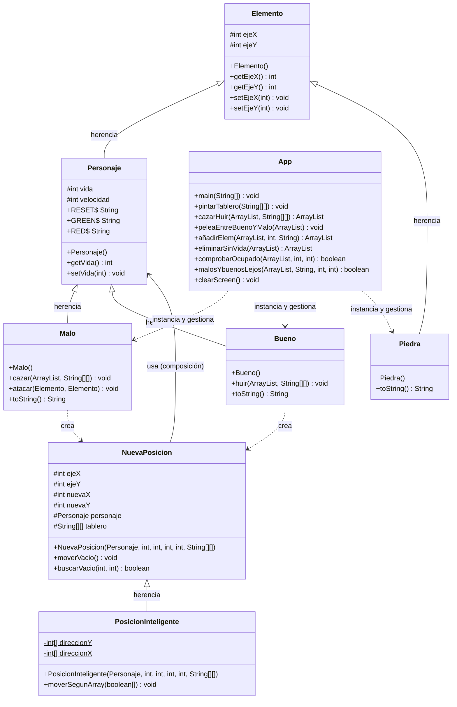

# 9. Diagrama de Clases UML

## Diagrama en Mermaid

El siguiente diagrama representa la estructura del proyecto tras aplicar la refactorización. Muestra las clases principales, sus atributos y métodos más relevantes, la visibilidad de sus miembros y las relaciones entre ellas.

---

## Interpretación del diagrama

### Jerarquía de entidades del tablero

La clase `Elemento` es la raíz de toda la jerarquía de entidades visibles en el tablero. Almacena las coordenadas `ejeX` y `ejeY` con las que cualquier objeto sabe dónde está en la cuadrícula de 100×20 celdas.

`Personaje` extiende `Elemento` añadiendo el concepto de entidad viva: tiene `vida` (fija en 50 al nacer) y `velocidad`. De `Personaje` heredan `Malo` y `Bueno`, que son los dos tipos de agentes activos de la simulación. `Piedra`, en cambio, hereda directamente de `Elemento` porque no tiene vida ni se mueve: solo ocupa espacio.

### Lógica de movimiento

`NuevaPosicion` es la clase responsable de calcular el siguiente movimiento de un personaje. Recibe un `Personaje` por composición (lo guarda internamente) junto con las coordenadas actuales y el destino, y genera un mapa de posiciones libres alrededor del personaje.

`PosicionInteligente` extiende `NuevaPosicion` con la lógica de elegir la posición óptima dentro de ese mapa: si el personaje es un `Malo`, selecciona la celda que más le acerca al objetivo; si es un `Bueno`, la que más le aleja. Esta distinción de comportamiento dentro de la misma clase es una decisión de diseño discutible (ver sección de mejoras detectadas).

`Malo` y `Bueno` crean instancias de `NuevaPosicion` dentro de sus métodos `cazar` y `huir` respectivamente, por lo que la relación es de dependencia puntual (línea discontinua), no de asociación permanente.

### Clase principal

`App` actúa como coordinador de la simulación. No es parte de la jerarquía de entidades: gestiona el bucle principal del juego, inicializa el `ArrayList<Elemento>` con todos los objetos, delega la lógica de movimiento en `Malo` y `Bueno`, y se encarga de pintar el tablero y detectar la condición de victoria.

### Posibles mejoras estructurales detectadas

1. **`App` sigue siendo un punto de alta responsabilidad.** Aunque se extrajo lógica a los propios personajes con `cazar` y `huir`, la clase `App` aún mezcla la inicialización del juego, el bucle, el pintado y la detección de fin de partida. Extraer una clase `GestorJuego` o `Simulacion` aliviaría esta concentración.

2. **La lógica de Malo/Bueno dentro de `PosicionInteligente` no es extensible.** El método `moverSegunArray` usa comprobaciones `personaje.getClass() == Malo.class` para decidir el comportamiento. Esto viola el principio abierto/cerrado: si se añadiera un nuevo tipo de personaje, habría que modificar esta clase. Una solución más limpia sería definir un método abstracto o una interfaz `Estrategia` que cada personaje implementara.

3. **`Piedra` no tiene comportamiento propio.** Se podría modelar como una constante o como un tipo especial dentro de `Elemento` en vez de una subclase independiente, ya que su única aportación es el símbolo visual.
